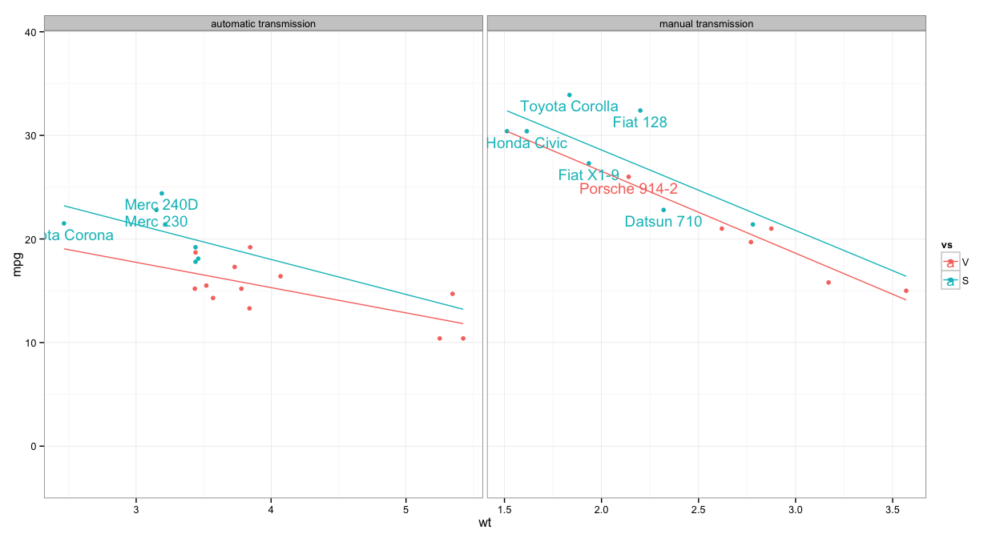

<a href="mailto:raredd01@gmail.com?subject=rgraphics">email</a>

Most recent compile: 28 April 2014 (R version 3.0.3 (2014-03-06))


```r
# library(rawr)       # ~rredd/r.packages
# library(ggplot2)    # plots
# library(reshape2)   # data manipulation
# library(gridExtra)  # for arranging grid graphics
# library(survival)   # survival formula/plot
# library(plyr)       # data analysis


op <- par(no.readonly = TRUE)


installr <- function(pckgs = c('ggplot2','plyr','reshape2','gridExtra','survival','devtools'),
                     git_pckgs = c('raredd/rawr'), ...,
                     dependencies = TRUE, repos = 'http://cran.r-project.org') {
  
  if (!is.null(pckgs)) {
    invisible(sapply(pckgs, function(x) {
    if (!try(require(x, character.only = TRUE))) {
      cat('Installing', x, 'from CRAN\n')
      install.packages(x, dependencies = dependencies, repos = repos)
    require(x, character.only = TRUE)
    } else 
      cat(x, 'package installed\n')
    }))
  }
  
  if (!is.null(git_pckgs)) {
    invisible(sapply(git_pckgs, function(x) {
      pkg <- strsplit(x, '/')[[1]][2]
      if (!try(require(pkg, character.only = TRUE))) {
        cat('Installing', pkg, 'from github\n')
        devtools::install_github(repo = x, ...)
        require(pkg, character.only = TRUE)
      } else 
        cat(pkg, 'package installed\n')
    }))
  }
}

## run this function to install and/or load all required packages
installr()
```

```
## ggplot2 package installed
## plyr package installed
## reshape2 package installed
## gridExtra package installed
## survival package installed
## devtools package installed
## rawr package installed
```


### graphics in r and ggplot2

#### outline
* intro: little about r
  * univ of auckland ("colour," "summarise")
  * `?update`, `?relevel`, `?'?'`: man pages for functions, special characters
  * `??update`: search the help system
  * `apropos('partial string')`: search function names using partial matching
  * `?plyr::plyr` (syntax: `packagename::function`)
* base vs lattice vs gg
* plots
  * scatters (with fit lines)
  * histograms, barplots, error bars
  * boxplots
  * survival curves
* viewing files - open a graphics device
  * x graphics device: `x11()` (-nix, mac, and windows)
  * `quartz()`: mac
  * `windows()`: windows
* saving files
  * export from r/rstudio
  * format-specific graphics devices (pfd, png, etc)
  * other devices (x11, quartz, windows)
* r and ggplot tips/tricks

### graphics systems

* base graphics
  * barplot, boxplot, dotchart, hist, qqnorm, stripchart, qqplot, plot, image, contour, persp, pairs
* grid graphics (add-on packages)
  * lattice: barchart, bwplot, densityplot, dotplot, histogram, qqmath, stripplot, qq, xyplot, levelplot, contourplot, cloud, wireframe, splom, parallel
  * ggplot2: qplot, ggplot
  
lattice: not discussed here


  
### base graphics

Common functions for plotting in base graphics.

function | usage
---------|------
barplot  | `barplot(height, ...)`
boxplot  |  `boxplot(x, ...)`
contour plot | `contour(x, ...)`
Cleveland's dot plot | `dotchart(x, ...)`
histogram| `hist(x, ...)`
q/q plot | `qqnorm(y, ...)`, `qqline`, `qqplot`
x-y plot |  `plot(x, y, ...)`
matrix of scatter plots | `pairs(x, ...)`
**others**| 
add lines to plot   | `lines(x, ...)`, `abline`
add points to plot  | `points(x, ...)`
add segment to plot | `segments(x0, y0, ...)`
axes options | `axis(...)`
margin text  | `mtext(...)`
arrows       | `arrows(...)`


```r
## graphical parameters
?par
example(par)

## examples:
example(barplot)
example(lines)
```


### example of base vs ggplot graphics


```r
str(mtcars)
```

```
## 'data.frame':	32 obs. of  11 variables:
##  $ mpg : num  21 21 22.8 21.4 18.7 18.1 14.3 24.4 22.8 19.2 ...
##  $ cyl : num  6 6 4 6 8 6 8 4 4 6 ...
##  $ disp: num  160 160 108 258 360 ...
##  $ hp  : num  110 110 93 110 175 105 245 62 95 123 ...
##  $ drat: num  3.9 3.9 3.85 3.08 3.15 2.76 3.21 3.69 3.92 3.92 ...
##  $ wt  : num  2.62 2.88 2.32 3.21 3.44 ...
##  $ qsec: num  16.5 17 18.6 19.4 17 ...
##  $ vs  : num  0 0 1 1 0 1 0 1 1 1 ...
##  $ am  : num  1 1 1 0 0 0 0 0 0 0 ...
##  $ gear: num  4 4 4 3 3 3 3 4 4 4 ...
##  $ carb: num  4 4 1 1 2 1 4 2 2 4 ...
```

```r
# simply in base r
hist(mtcars$mpg)
```

<figure><figcaption>Figure 1: Simple graphics in base and ggplot</figcaption></figure>

```r
# slightly more verbose
ggplot(data = mtcars, aes(x = mpg)) + geom_histogram(binwidth = 5)
```

<figure><figcaption>Figure 2: Simple graphics in base and ggplot</figcaption></figure>


### ggplot

  * "grammar of graphics," Wilkinson (2005)

  * structure of a language: nouns, verbs, adjectives, adverbs, etc.

  * structure of a graphic: data, mappings, colors, layout, etc.

  * grammar of graphics introduces a "theory" which allows for reassembly into new types of graphics

“In brief, the grammar tells us that a statistical graphic is a **mapping** from **data** to **aesthetic** attributes (colour, shape, size) of **geometric** objects (points, lines, bars). The plot may also contain statistical **transformations** of the data and is drawn on a specific **coordinate** system.” - *ggplot2: Elegant Graphics for Data Analysis* (http://ggplot2.org/book/)


```r
## structure of a ggplot call:
ggplot(data = , aes(x = , y = , colour = , ...)) +
  geom_*() +
  facet_*() +
  theme() +
  stat_smooth() +
  scale_*() + 
  coord_*() +
  position_*()
```


* data
* aesthetic mapping
  * x, y, colour, size, fill, shape, linetype
  * aes_string for passing quoted names (e.g., `aes(x = 'xvar','yvar')`)
* geometric shapes to represent data
  * geom_line
  * geom_boxplot
  * geom_histogram
  * geom_text
  * geom_density
  * `apropos('geom_')` for other options
* faceting for splitting plots
  * facet_wrap (single grouping variable)
  * facet_grid (interaction of two variables)
  * https://github.com/hadley/ggplot2/wiki/labeller
  * `rawr::facet.adjust`
* theme for overal appearance
  * theme_bw
  * theme_minimal
  * `apropos('theme_')` for other options
* statistical summaries and transformations
  * stat_smooth
  * stat_summary
  * `apropos('stat_')` for other options
* scales - mapping between data and the aesthetic dimensions
  * scale_fill_discrete
  * scale_x_continuous
  * scale_y_discrete
  * `apropos('scale_')` for other options
* coordinate systems for mapping to planes
  * coord_cartesian
  * coord_flip
  * coord_polar
  * `apropos('coord_')` for other options
* position adjustments for geoms
  * position_dodge
  * position_fill
  * position_identity
  * position_jitter
  * position_stack

#### some ways to find help:


```r
# find objects by partial names
apropos("geom_")
# list help files
help.search("geom_", package = "ggplot2")
```


### choosing

some things to keep in mind:
* simple graphics: base
* complex graphics quickly: ggplot
* methods
  * ggplot only uses data frames for data input
  * base graphics use vectors, matrices, data frames/data tables, tables/xtabs, etc.
* grid graphics: ggplot (and lattice)
  * base and grid graphics may be combined but with additional work


#### a more complex graphic in base vs ggplot:
using a built-in data set: `data(mtcars)`

create a plot of mtcars and
1. color by V or straight engine
2. separate plots for manual and automatic
3. line of best fit
4. label cars with < 100 horse power


```r
rbind(head(mtcars), "...", tail(mtcars))
```

```
##                    mpg cyl  disp  hp drat    wt  qsec  vs  am gear carb
## Mazda RX4           21   6   160 110  3.9  2.62 16.46   0   1    4    4
## Mazda RX4 Wag       21   6   160 110  3.9 2.875 17.02   0   1    4    4
## Datsun 710        22.8   4   108  93 3.85  2.32 18.61   1   1    4    1
## Hornet 4 Drive    21.4   6   258 110 3.08 3.215 19.44   1   0    3    1
## Hornet Sportabout 18.7   8   360 175 3.15  3.44 17.02   0   0    3    2
## Valiant           18.1   6   225 105 2.76  3.46 20.22   1   0    3    1
## 7                  ... ...   ... ...  ...   ...   ... ... ...  ...  ...
## Porsche 914-2       26   4 120.3  91 4.43  2.14  16.7   0   1    5    2
## Lotus Europa      30.4   4  95.1 113 3.77 1.513  16.9   1   1    5    2
## Ford Pantera L    15.8   8   351 264 4.22  3.17  14.5   0   1    5    4
## Ferrari Dino      19.7   6   145 175 3.62  2.77  15.5   0   1    5    6
## Maserati Bora       15   8   301 335 3.54  3.57  14.6   0   1    5    8
## Volvo 142E        21.4   4   121 109 4.11  2.78  18.6   1   1    4    2
```


```r
## base
par(mfrow = c(1, 2),
    mar = c(4,4,2,2))
invisible(
  ## loop this code twice for each transmission type (am = 0 or 1)
  sapply(0:1, function(x) {
  with(mtcars[mtcars$am %in% x, ], 
       plot(mpg ~ wt, 
            xlim = ifelse(x == c(1, 1), c(1.5, 3.5), c(2, 6)),
            ylim = c(0, 40),
            main = paste0(ifelse(x %in% 0, 'automatic', 'manual'),
                          ' transmission'),
            pch = 19,
            col = ifelse(vs %in% 0, '#F8766D', '#00BFC4')))
  with(mtcars[mtcars$am %in% x & mtcars$vs %in% 0, ], 
       abline(lm(mpg ~ wt), col = '#F8766D'))
  with(mtcars[mtcars$am %in% x & mtcars$vs %in% 1, ], 
       abline(lm(mpg ~ wt), col = '#00BFC4'))
  with(dat <- mtcars[mtcars$hp < 100 & mtcars$am %in% x, ],
       text(x = wt, y = mpg, 
            pos = 1,    # position of text (1 = under points)
            labels = rownames(dat),
            col = ifelse(vs %in% 0, '#F8766D', '#00BFC4')))
  legend('topright', bty = 'n',
         title = 'vs',
         legend = c('0', '1'),
         pch = 19, 
         col = c('#F8766D', '#00BFC4'))
  }))
```

<figure><figcaption>Figure 3: Simple graphics in base and ggplot</figcaption></figure>

```r
## ggplot
## it is much easier to format data before plotting with ggplot
## rather than manipulating the layers after the plot is created
dat <- within(mtcars, {
  vs <- factor(vs, 
               levels = c(0, 1),
               labels = c('V', 'S'))
  am <- factor(am, 
               levels = c(0, 1), 
               labels = c('automatic transmission','manual transmission'))
  make <- rownames(mtcars)
})
dat1 <- dat[dat$hp < 100, ]
(p <- ggplot(data = dat, aes(x = wt, y = mpg, colour = vs)) + 
        geom_point() +
        geom_smooth(method = 'lm', fullrange = TRUE, fill = NA) +
        geom_text(data = dat1, aes(label = make), vjust = 1.5) +
        facet_grid( ~ am, scales = 'free') +
        theme_bw()) 
```

<figure><figcaption>Figure 4: Simple graphics in base and ggplot</figcaption></figure>


### barplots, histograms


```r
## ggplot
geom_bar(mapping = NULL, data = NULL, stat = "bin", 
         position = "stack", ...)

## base
barplot(height, width = 1, space = NULL,
        names.arg = NULL, legend.text = NULL, beside = FALSE,
        horiz = FALSE, density = NULL, angle = 45,
        col = NULL, border = par("fg"),
        main = NULL, sub = NULL, xlab = NULL, ylab = NULL,
        xlim = NULL, ylim = NULL, xpd = TRUE, log = "",
        axes = TRUE, axisnames = TRUE,
        cex.axis = par("cex.axis"), cex.names = par("cex.axis"),
        inside = TRUE, plot = TRUE, axis.lty = 0, offset = 0,
        add = FALSE, args.legend = NULL, ...)
```


#### bar plot examples

using the diamonds data set from the ggplot2 package


```r
data(diamonds)
rbind(head(diamonds), "...", tail(diamonds))
```

```
##       carat       cut color clarity depth table price    x    y    z
## 1      0.23     Ideal     E     SI2  61.5    55   326 3.95 3.98 2.43
## 2      0.21   Premium     E     SI1  59.8    61   326 3.89 3.84 2.31
## 3      0.23      Good     E     VS1  56.9    65   327 4.05 4.07 2.31
## 4      0.29   Premium     I     VS2  62.4    58   334  4.2 4.23 2.63
## 5      0.31      Good     J     SI2  63.3    58   335 4.34 4.35 2.75
## 6      0.24 Very Good     J    VVS2  62.8    57   336 3.94 3.96 2.48
## 7       ...      <NA>  <NA>    <NA>   ...   ...   ...  ...  ...  ...
## 53935  0.72   Premium     D     SI1  62.7    59  2757 5.69 5.73 3.58
## 53936  0.72     Ideal     D     SI1  60.8    57  2757 5.75 5.76  3.5
## 53937  0.72      Good     D     SI1  63.1    55  2757 5.69 5.75 3.61
## 53938   0.7 Very Good     D     SI1  62.8    60  2757 5.66 5.68 3.56
## 53939  0.86   Premium     H     SI2    61    58  2757 6.15 6.12 3.74
## 53940  0.75     Ideal     D     SI2  62.2    55  2757 5.83 5.87 3.64
```


make some default ggplot graphics an then re-create them using base r functions:


```r
(counts <- with(diamonds, table(cut, clarity)))
```

```
##            clarity
## cut           I1  SI2  SI1  VS2  VS1 VVS2 VVS1   IF
##   Fair       210  466  408  261  170   69   17    9
##   Good        96 1081 1560  978  648  286  186   71
##   Very Good   84 2100 3240 2591 1775 1235  789  268
##   Premium    205 2949 3575 3357 1989  870  616  230
##   Ideal      146 2598 4282 5071 3589 2606 2047 1212
```

```r
plot(t(counts), type = 'h')
```

<figure><figcaption>Figure 5: Bar plots</figcaption></figure>

```r
## ggplot
grobs <- list(
  ggplot(diamonds, aes(clarity, fill = cut)) + 
    geom_bar(position = 'stack') + ggtitle('1: stack'),
  ggplot(diamonds, aes(clarity, fill = cut)) + 
    geom_bar(position = 'dodge') + ggtitle('2: dodge'),
  ggplot(diamonds, aes(clarity, fill = cut)) + 
    geom_bar(position = 'fill') + ggtitle('3: fill'),
  ggplot(diamonds, aes(clarity, fill = cut)) + 
    geom_bar(position = 'identity', alpha = .3) + ggtitle('4: identity')) 
(do.call(arrangeGrob, c(grobs, list(nrow = 2, ncol = 2))))
```

<figure><figcaption>Figure 6: Bar plots</figcaption></figure>

```r
## base
par(mfrow = c(2, 2),    # two rows, two columns
    mar = c(4,4,2,1))  # expand margins
# plot 1
barplot(counts, main = '1: stack',
        col = ggcols(5), 
        border = NA, 
        axis.lty = 1)
legend('topright', bty = 'n',
       title = 'cut',
       legend = rownames(counts),
       fill = ggcols(5))
# plot 2
par(xpd = TRUE) # turn off clipping outside plotting region
barplot(counts, main = '2: dodge',
        col = ggcols(5), 
        border = NA, 
        beside = TRUE, axis.lty = 1)
legend('topright', bty = 'n', 
       title = 'cut',
       legend = rownames(counts),
       fill = ggcols(5))
# plot 3
## need cell percentages instead of counts:
props <- prop.table(counts, margin = 2)
barplot(props, main = '3: fill',
        col = ggcols(5), 
        border = NA, 
        axis.lty = 1,
        xlim = c(0, ncol(props) + 5)) # some extra space for legend
legend('topright',
       bty = 'n',
       title = 'cut',
       legend = rownames(props),
       fill = ggcols(5))
# plot 4
## this one is not a default option (to my knowledge) in base, but we can try 
## to match the ggplot graphic (in a slightly hacky way) by plotting layers of
## barplots and using a transparent colors function from the rawr package
## rawr::tcol
invisible(sapply(1:nrow(counts), function(x)
  barplot(counts[x, ], 
          axes = FALSE, axisnames = FALSE, # avoid overplotting axes
          main = '4: identity',
          border = NA,
          col = tcol(ggcols(5)[x], 50), 
          axis.lty = 1,
          ylim = c(0, 5000), 
          add  = ifelse(x == 1, FALSE, TRUE)))) # allow layers of barplots
axis(1, at = barplot(counts, plot = FALSE), labels = colnames(counts))
axis(2, at = seq(0, 5000, 1000), labels = seq(0, 5000, 1000))
legend('topright',
       bty = 'n',
       title = 'cut',
       legend = rownames(props),
       fill = tcol(ggcols(5), 100))
```

<figure><figcaption>Figure 7: Bar plots</figcaption></figure>


#### with error bars


```r
## calculate some data summaries:
library(plyr, quietly = TRUE)
set.seed(1618)
(df1 <- ddply(diamonds[sample(nrow(diamonds), 100), ], .(clarity), summarise,
             mean = mean(carat),
             median = median(carat),
             n = length(carat),
             sd = sd(carat),
             sem = sd(carat) / sqrt(length(carat)),
             lci = quantile(carat, .025),
             uci = quantile(carat, .975)))
```

```
##   clarity   mean median  n     sd     sem    lci   uci
## 1     SI2 1.1833   1.05 24 0.5728 0.11692 0.3115 2.163
## 2     SI1 0.7305   0.72 19 0.3793 0.08701 0.2560 1.384
## 3     VS2 0.8824   0.61 21 0.5948 0.12981 0.2750 2.030
## 4     VS1 0.7421   0.71 19 0.3627 0.08322 0.2935 1.538
## 5    VVS2 0.6675   0.58  8 0.2408 0.08514 0.4010 1.018
## 6    VVS1 0.4720   0.42  5 0.1577 0.07053 0.3180 0.700
## 7      IF 0.6525   0.46  4 0.5007 0.25035 0.3068 1.325
```

```r
## another way using base R
set.seed(1618)
df2 <- with(diamonds[sample(nrow(diamonds), 100), ], 
            data.frame(
              clarity = levels(clarity),
              mean = tapply(carat, clarity, mean),
              median = tapply(carat, clarity, median),
              n = tapply(carat, clarity, length),
              sd = tapply(carat, clarity, sd),
              sem = tapply(carat, clarity, sd) / 
                sqrt(tapply(carat, clarity, length)),
              lci = tapply(carat, clarity, quantile, .025),
              lci = tapply(carat, clarity, quantile, .975)))
## ggplot
grobs <- list(
  # plot 1
  ggplot(df1, aes(clarity, mean)) + ggtitle('1: sem') +
    geom_bar(fill = 'blue', stat = 'identity') +
    geom_errorbar(aes(ymin = mean - sem, ymax = mean + sem), width = .2),
  # plot 2
  ggplot(df1, aes(clarity, mean)) + ggtitle('2: 95% CI') +
    geom_bar(fill = 'blue', stat = 'identity') +
    geom_errorbar(aes(ymin = lci, ymax = uci), width = .2))
(do.call(arrangeGrob, c(grobs, list(nrow = 1, ncol = 2))))
```

<figure><figcaption>Figure 8: Bar plots</figcaption></figure>

```r
## base
## (a hacky way) using the arrows function
par(mfrow = c(1, 2),     # one row, two columns
    mar = c(4, 4, 2, 1)) # expand margins
# plot 1
bp <- barplot(df1$mean, main = '1: sem',
              ylim = c(0, 1.5), col = 'blue', xlab = 'mean')
axis(1, at = bp, labels = df1$clarity)
with(df1, 
     arrows(x0 = bp, y0 = mean + sem, # "draw from x0, y0 ..."
            x1 = bp, y1 = mean,       # "... then draw to x1, y1"
            angle = 90, code = 2,     # appearance of the arrows
            length = .05))            # width of the arrow heads
with(df1, 
     arrows(x0 = bp, y0 = mean - sem,
            x1 = bp, y1 = mean,
            angle = 90, code = 1, length = .05))
# plot 2
bp <- barplot(df1$median, main = '2: 95% CI',
              ylim = c(0, 2.5), col = 'blue', xlab = 'mean')
axis(1, at = bp, labels = df1$clarity)
with(df1, 
     arrows(x0 = bp, y0 = uci,    # draw from
            x1 = bp, y1 = median, # draw to
            angle = 90, code = 1, length = .05))
with(df1, 
     arrows(bp, lci, bp, median, angle = 90, code = 1, length = .05))
```

<figure><figcaption>Figure 9: Bar plots</figcaption></figure>

```r
## alternatively, using plotCI from the plotrix package
# plot 1
bp <- barplot(df1$mean, ylim = c(0, 1.5), col = 'blue', ylab = 'mean',
              main = '1: sem')
plotrix::plotCI(x = bp, y = df1$mean, uiw = df1$sem, add = TRUE, slty = 2)
# plot2
bp <- barplot(df1$median, ylim = c(0, 2.5), col = 'blue', ylab = 'mean',
              main = '2: 95% CI')
plotrix::plotCI(bp, df1$median, ui = df1$uci, li = df1$lci, add = TRUE)
```

<figure><figcaption>Figure 10: Bar plots</figcaption></figure>


#### histograms
... are bar plots so no examples


```r
## ggplot
?geom_histogram
        
        # geom_histogram is an alias for geom_bar plus stat_bin 

geom_bar(mapping = NULL, data = NULL, stat = "bin", 
         position = 'stack', ...)

geom_histogram(mapping = NULL, data = NULL, stat = 'bin',
               position = 'stack', ...)


## base
hist(x, breaks = "Sturges",
     freq = NULL, probability = !freq,
     include.lowest = TRUE, right = TRUE,
     density = NULL, angle = 45, col = NULL, border = NULL,
     main = paste("Histogram of" , xname),
     xlim = range(breaks), ylim = NULL,
     xlab = xname, ylab,
     axes = TRUE, plot = TRUE, labels = FALSE,
     nclass = NULL, warn.unused = TRUE, ...)
```


### box plots


```r
## ggplot
geom_boxplot(mapping = NULL, data = NULL, stat = "boxplot",
  position = "dodge", outlier.colour = "black", outlier.shape = 16,
  outlier.size = 2, notch = FALSE, notchwidth = 0.5, ...)


## base
boxplot(formula, data = NULL, ..., subset, na.action = NULL)

boxplot(x, ..., range = 1.5, width = NULL, varwidth = FALSE,
        notch = FALSE, outline = TRUE, names, plot = TRUE,
        border = par("fg"), col = NULL, log = "",
        pars = list(boxwex = 0.8, staplewex = 0.5, outwex = 0.5),
        horizontal = FALSE, add = FALSE, at = NULL)
```


#### box plot examples


```r
grobs <- list(
  # plot 1
  ggplot(mtcars, aes(factor(vs), mpg, fill = factor(am))) + 
    geom_boxplot() + 
    ggtitle('1: grouped box plot'),
  # plot 2
  ggplot(mtcars, aes(factor(cyl), mpg, fill = factor(cyl))) + 
    geom_boxplot(outlier.colour = NA) + # don't show outliers
    scale_colour_manual(values = c('red', 'green', 'blue')) + 
    geom_point(position = 'jitter') + # random position noise
    labs(title = '2: with points', 
         x = 'Number of cylinders', 
         y = 'Miles per gallon',
         fill = 'Cylinders'),  # or colour = '' if color = factor(cyl) was used
  # plot 3
  ggplot(mtcars, aes(factor(cyl), mpg)) + 
    geom_dotplot(aes(fill = factor(cyl)), binaxis = 'y', dotsize = .8,
                 stackdir = 'center', binwidth = 0.8) +
    stat_summary(fun.y = median, 
                 fun.ymin = median, 
                 fun.ymax = median, 
                 geom = 'crossbar', width = 0.7) + 
    coord_flip() + 
    ggtitle('3: horizontal with points beside'),
  # plot 4
  last_plot() + geom_boxplot(fill = NA) + ggtitle('4: overlay boxes'))
(do.call(arrangeGrob, c(grobs, nrow = 2, ncol = 2)))
```

<figure><figcaption>Figure 11: Box plots</figcaption></figure>

```r
## base
# plot 1
par(mfrow = c(2, 2),
    mar = c(4,4,2,1))
boxplot(mpg ~ vs + am, data = mtcars,
        names = c('V-engine\nAutomatic','S-engine\nAutomatic',
                  'V-engine\nManual','S-engine\nManual'),
        at = c(1:3, 5),
        width = rep(4, 4),
        boxfill = ggcols(4),
        las = 2,
        main = '1: grouped box plot')
# plot 2
boxplot(mpg ~ cyl, data = mtcars, 
        main = '2: with points',
        xlab = 'number of\ncylinders',
        ylab = 'Miles per gallon',
        boxfill = c('red','green','blue'))
with(mtcars, 
     points(jitter(cyl / 2 - 1), mpg, # x values are 1:3 not 4,6,8 (cyl values)
            col = 'black', pch = 20))
# plot 3
boxplot(mpg ~ cyl, data = mtcars, 
        border = NA, horizontal = TRUE,
        xlab = 'mpg', ylab = 'cyl',
        main = '3: horizontal with points beside')
segments(tapply(mtcars$mpg, mtcars$cyl, median), 
         y0 = 1:3 - .2, y1 = 1:3 + .2, lwd = 5)
## there is no equivalent to this in base r (to my knowledge), so here is how
## I calculated the offset to "dodge" points
## I added a similar function in the rawr package (rawr::dodge)
require(plyr)
dat <- ddply(mtcars, .(cyl, mpg), transform, 
             offset = (1:length(cyl) - 1) / 10)
dat <- ddply(dat, .(cyl, mpg), transform, 
             offset = offset - mean(offset))
with(dat, points(mpg, cyl / 2 - 1 + offset, 
                 pch = 19, cex = .8, col = rep(c('red','green','blue'),
                                               times = table(dat$cyl))))
# plot 4
boxplot(mpg ~ cyl, data = mtcars, 
        outline = FALSE,
        ylim = c(10, 40),
        horizontal = TRUE,
        main = '4: horizontal with points beside',
        xlab = 'Miles per gallon',
        ylab = 'number of\ncylinders',
        boxfill = c('red','green','blue'))
with(dat, points(mpg, cyl / 2 - 1 + offset, 
                 pch = 19, cex = .8))
```

<figure><figcaption>Figure 12: Box plots</figcaption></figure>


### survival curves

Two popular functions for plotting survival curves:
  * `survival:::plot.survfit` from the "survival" package
  * `survplot` from the "rms" package
 

```r
library(survival)
?survival:::plot.survfit
plot(x, conf.int, mark.time = TRUE, mark = 3, col = 1, lty = 1, 
     lwd = 1, cex = 1, log = FALSE, xscale = 1, yscale = 1, firstx = 0, 
     firsty = 1, xmax, ymin = 0, fun, xlab = "", ylab = "", xaxs = "S", ...) 
example(survfit)

library(rms)
?rms:::survplot.survfit
survplot(fit, xlim, ylim, xlab, ylab, time.inc, 
         conf = c("bands", "bars", "diffbands", "none"), add = FALSE, 
         label.curves = TRUE, abbrev.label = FALSE, levels.only = FALSE, 
         lty, lwd = par("lwd"), col = 1, col.fill = gray(seq(0.95, 0.75, length = 5)), 
         loglog = FALSE, fun, n.risk = FALSE, logt = FALSE, dots = FALSE,
         dotsize = 0.003, grid = NULL, srt.n.risk = 0, sep.n.risk = 0.056, 
         adj.n.risk = 1, y.n.risk, cex.n.risk = 0.6, pr = FALSE, ...) 
example(survplot)
```


Two more from "rawr" package
  * `kmplot` in base graphics
  * `ggsurv` using ggplot


```r
library(rawr)
kmplot(s,
       # basic plot options
       lty.surv = 1, lwd.surv = 1, col.surv = 1,
       mark = 3,

       # confidence options
       lty.ci = 0, lwd.ci = 1, col.ci = col.surv,
       col.band = col.surv,

       # at risk table options
       atrisk = TRUE, atrisk.lab = 'Number at risk',
       atrisk.lines = TRUE, strata.lab = NULL,
       strata.order = seq(length(s$n)),
       extra.margin = 5,

       # aesthetics
       xlim = c(0, max(s$time)), ylim = c(0, 1),
       xaxis.at = pretty(s$time), xaxis.lab = xaxis.at,
       yaxis.at = pretty(ylim), yaxis.lab = yaxis.at,
       xlab = 'Time', ylab = 'Survival probability',
       main = '', cex.axis = 1,
       legend = !is.null(s$strata), legend.pos = 'bottomleft',

       # other options
       grid = TRUE, lty.grid = 1, lwd.grid = 1,
       col.grid = grey(.9),
       dev = TRUE, add = FALSE, ...)
example(kmplot)


ggsurv(s,
       # basic plot options
       surv.col = NULL, surv.lty = 1,
       censor = TRUE, cens.col = NULL, cens.shape = 3,

       # confidence options
       confin = TRUE, confband = FALSE, band.col = NULL,

       # extra plot options
       median = FALSE, atrisk = TRUE, atrisk.col = NULL,
       pval = NULL, basehaz = FALSE,

       # aesthetics
       ticks = NULL, median.ticks = TRUE,
       xlab = NULL, ylab = NULL, main = NULL,
       xlim = NULL, ylim = NULL,
       legend = 'right', legend.labels = NULL,
       grid = TRUE, ggdefault = FALSE,

       # other options
       plot.margin = NULL, table.margin = NULL,
       data = FALSE)
example(ggsurv)
```


#### survival examples


```r
library(survival)
data(cancer)
cancer <- within(cancer, {
    age.cat <- factor(as.numeric(cut(age, c(-Inf, 50, 60, 70, Inf))))
    meal.cat <- factor(as.numeric(cut(meal.cal, c(-Inf, quantile(meal.cal, c(0.25, 
        0.5, 0.75), na.rm = TRUE), Inf))))
    wt.cat <- factor(as.numeric(cut(wt.loss, c(-Inf, quantile(wt.loss, c(0.25, 
        0.5, 0.75), na.rm = TRUE), Inf))))
})

## lung cancer data kaplan-meier
kmfit0 <- survfit(Surv(time = time, event = status) ~ 1, data = cancer, conf.type = "log-log")
kmfit1 <- survfit(Surv(time = time, event = status) ~ sex, data = cancer, conf.type = "log-log")
# cox proportional hazards
coxfit0 <- survfit(coxph(Surv(time = time, event = status) ~ strata(age.cat), 
    data = cancer))
coxfit1 <- survfit(coxph(Surv(time = time, event = status) ~ strata(I(age > 
    45)), data = cancer))

### example plots plot 1
kmplot(kmfit0, lty.ci = 2, col.band = NULL, dev = FALSE, atrisk = FALSE)
```

<figure><figcaption>Figure 13: Survival curves</figcaption></figure>

```r
ggsurv(kmfit0, atrisk = FALSE)
```

<figure><figcaption>Figure 14: Survival curves</figcaption></figure>

```r
# plot 2
kmplot(kmfit1, dev = FALSE, lty.surv = 1:2, col.surv = "blue", col.band = NULL)
```

<figure><figcaption>Figure 15: Survival curves</figcaption></figure>

```r
ggsurv(kmfit1, confin = FALSE, surv.lty = 1:2, cens.col = "blue", grid = FALSE, 
    pval = c(500, 0.75))
```

```
## ticks not specified: 
## tick marks defaulting to seq(0, max(time), length.out = 10)
```

```
## Call:
## survdiff(formula = eval(s$call$formula), data = eval(s$call$data), 
##     rho = 0)
## 
##         N Observed Expected (O-E)^2/E (O-E)^2/V
## sex=1 138      112     91.6      4.55      10.3
## sex=2  90       53     73.4      5.68      10.3
## 
##  Chisq= 10.3  on 1 degrees of freedom, p= 0.00131
```

```
## when atrisk == TRUE, legend should be FALSE, 'none', 'bottom', or 'top'
## position defaulting to 'bottom'
```

<figure><figcaption>Figure 16: Survival curves</figcaption></figure>

```r
# plot 3
kmplot(kmfit1, strata.lab = c("Male", "Female"), dev = FALSE, col.band = c("red", 
    "blue"))
```

<figure><figcaption>Figure 17: Survival curves</figcaption></figure>

```r
ggsurv(kmfit1, confin = FALSE, surv.lty = 1:2, cens.col = "red", confband = TRUE, 
    band.col = c("blue", "red"), legend.labels = c("Male", "Female"), median = TRUE, 
    ticks = c(0, 1000, 200))
```

```
## 
## strata labels recoded as follows:
## 
##   original replaced
## 1    sex=1     Male
## 2    sex=2   Female
## level(s) Male Female added to factor variable, survdat$strata 
## median survival times:
## sex=1 sex=2 
##   270   426
```

```
## Scale for 'x' is already present. Adding another scale for 'x', which will replace the existing scale.
## when atrisk == TRUE, legend should be FALSE, 'none', 'bottom', or 'top'
## position defaulting to 'bottom'
```

<figure><figcaption>Figure 18: Survival curves</figcaption></figure>


```r
# plot 4
kmplot(coxfit0, strata.lab = c("Less than 50", "50-60", "60-70", "70+"), dev = FALSE, 
    strata.order = 4:1, col.band = NULL, mark = "", col.surv = 1:4)
```

<figure><figcaption>Figure 19: Survival curves</figcaption></figure>

```r
ggsurv(coxfit0, confin = FALSE, atrisk.col = "black", surv.col = c("red", "green", 
    "blue", "black"), legend.labels = c("Less than 50", "50-60", "60-70", "70+"), 
    plot.margin = 3.5)
```

```
## ticks not specified: 
## tick marks defaulting to seq(0, max(time), length.out = 10)
```

```
## 
## strata labels recoded as follows:
## 
##    original     replaced
## 1 age.cat=1 Less than 50
## 2 age.cat=2        50-60
## 3 age.cat=3        60-70
## 4 age.cat=4          70+
## level(s) Less than 50 50-60 60-70 70+ added to factor variable, survdat$strata
```

```
## when atrisk == TRUE, legend should be FALSE, 'none', 'bottom', or 'top'
## position defaulting to 'bottom'
```

<figure><figcaption>Figure 20: Survival curves</figcaption></figure>


```r
# plot 5
ggsurv(coxfit1, confin = FALSE, median = TRUE, confband = FALSE,
  legend.labels = c('< 45','> 45'),
  surv.col = c('red','green'), cens.shape = '#', cens.col = 'black',
  legend = FALSE)
# plot 6
# ggsurv(coxfit0, basehaz = TRUE, legend = FALSE, plot.margin = 3.25,
#        ticks = c(0, 1000, 250))
## colon cancer data
kmfit1 <- survfit(Surv(time, status) ~ sex, data = colon)
kmfit2 <- survfit(Surv(time, status) ~ rx + adhere, data = colon)
# plot 7
kmplot(kmfit2,
       dev = FALSE,  # view in r window
       mark = '',    # no censor mark
       lty.ci = 2,   # dashed line for CIs
       xaxis.at = c(0, .5, 1:9) * 365,    # change days to years
       xaxis.lab = c(0, .5, 1:9),         # label years
       yaxis.lab = pretty(c(0, 1)) * 100, # change to percent
       xlab = 'Time (years)',
       ylab = 'Percent survival',
       col.surv = c('blue', 'red', 'green', 'black','purple','orange'),
       strata.lab = c('Obs ','Obs+ ','Lev ','Lev+ ','Lev5fu','Lev5fu+'),
       extra.margin = 8, # increase margin for long strata labels
       strata.order = c(5, 6, 3, 1, 4, 2),
       col.band = NULL, # remove confidence bands
       font = 2,  # bold table text
       bty = 'l', # L box type around plot
       tcl = .5)  # change length/direction of ticks
title(main = 'Chemotherapy for stage B/C colon cancer',
      adj = .5, font.main = 1, line = 0.5, cex.main = 1)
# plot 8
par(mfrow = c(2, 1))
kmplot(kmfit1, add = TRUE, # use add = TRUE to add to current device
       dev = FALSE, col.band = NA, lty.surv = 1:2)
kmplot(kmfit2, add = TRUE, dev = FALSE, extra.margin = 8, # extra space for table
       col.band = NA, lty.surv = 1:6, mark = '')
```


### viewing and saving files

#### option 1:

  * export directly from R/Rstudio:
  * quick but can distort tables and legends:
  


#### option 2:

  * open a device: x11, quartz, windows
  * send things to the device
  * can adjust aspect ratios, less distortion, and save files (optional)


```r
quartz()  # an OSX device
kmplot(kmfit1)
## view before closing device
dev.off()
```


#### option 3 (recommended):

```r
## open device to write to
png("./desktop/kmplot.png", width = 750, height = 1200, pointsize = 14)
## write things to the device
par(mfrow = c(2, 1))
kmplot(kmfit1, add = TRUE, dev = FALSE)
kmplot(kmfit2, add = TRUE, dev = FALSE, extra.margin = 8)
## close the device and view the file
dev.off()
```


Graphics formats and the functions that open an appropriate graphics device.

Device function | Graphical format
----------------|----------------
**Screen/GUI Devices** | 
x11() or X11()      | X Window window 
windows()           | Microsoft Windows window 
quartz()            | Mac OS X Quartz window
 | 
**File Devices**    |  
postscript()        | Adobe PostScript file
pdf()               | Adobe PDF file
pictex()            | LaTeXPicTEX file
xfig()              | XFIG file
bitmap()            | GhostScript conversion to file
png()               | PNG bitmap file
jpeg()              | JPEG bitmap file
*(Windows only)*    | 
win.metafile()      | Windows Metafile file 
bmp()               | Windows BMP file
 | 
**Devices provided by add-on package** |
Cairo               | bitmap, vector, display output
devGTK()            | GTK window (gtkDevice)
devJava()           | Java Swing window (RJavaDevice)
devSVG()            | SVG file (RSvgDevice)

### reproducible graphs and time-savers


```r
## save a custom layer or theme to be used in many gg objects:
mybar <- geom_bar()
myaes <- aes()

mytheme <- theme(panel.border = element_blank(),
                 legend.key = element_blank(),
                 axis.ticks = element_blank(),
                 axis.text.y = element_blank(),
                 panel.grid.major = element_line(colour = 'lightblue', size = 2),
                 panel.grid.minor = element_line(colour = 'red', 
                                                 linetype = 'dotted'),
                 legend.position = c(.75, .75),
                 legend.background = element_rect(colour = 'red'))

## example
grobs <- list(ggplot(mtcars, aes(factor(cyl), mpg, fill = vs)) + geom_point(),
              last_plot() + mytheme)
(do.call(arrangeGrob, c(grobs, ncol = 2)))
```

<figure><figcaption>Figure 21: Reproducible graphs and time-savers.</figcaption></figure>

```r
## similarly in base graphics:
# save current par settings
op <- par(no.readonly = TRUE)
# set new global par settings:
mypar <- par(mfrow = c(2, 1),
             mar = c(2, 3, 2, 5),
             xpd = TRUE,
             pch = '$',
             col = 'green',
             las = 2,
             bty = 'u')
# and reset with:
# par(op)
qqplot(rnorm(50, 5), rnorm(50))
abline(-5, 1)
hist(rnorm(50), prob = TRUE, main = '')
lines(density(rnorm(50)))
lines(density(rnorm(50), adjust = 2), lty = 'dotted', lwd = 3)
lines(density(rnorm(50), adjust = 2), lty = 'dotted', lwd = 5)
# locator() # handy function for finding specific coordinates in plot window
text(1.5, .4, 
     labels = expression(over(1+sqrt(5), 2)%~~%1.618<infinity),
     col = 'red', cex = 1.5)
```

<figure><figcaption>Figure 22: Reproducible graphs and time-savers.</figcaption></figure>

```r
## %+% operator in ggplot to modify ggplots
# ?'%+%'
set.seed(1618)
dat1 <- data.frame(x = c(rnorm(33), rnorm(33, 5, 1), rnorm(33, 0, 5)), 
                   y = rep(LETTERS[1:3], each = 33))
dat2 <- within(dat1, x <- sort(x))

grobs <- list(ggplot(dat1, aes(x, fill = y)) + geom_density(alpha = .25),
              last_plot() %+% dat2,
              last_plot() %+% dat1 + geom_text(x = -7.5, y = .2,
                                               label = ':)'),
              last_plot() %+% mytheme)
(do.call(arrangeGrob, c(grobs, ncol = 2, nrow = 2)))
```

<figure><figcaption>Figure 23: Reproducible graphs and time-savers.</figcaption></figure>

```r
## wrapper functions
## create a custom yet still generic plot function:
myplot <- function(x, y = NULL, ...) {
  m <- match.call()
  plot(x, y, pch = 19,
       col = ifelse(x > 0, 'blue','red'),
       main = if (is.null(y)) {
         paste0('my plot of ', deparse(m$x))
       } else
         paste0('my plot of ', deparse(m$x), '\nby ', deparse(m$y)),
       ...)
  if (!is.null(y))
    abline(lm(y ~ x), col = 'green', lty = 2, lwd = 3)
}

par(op)
par(mfrow = c(2, 2))
myplot(1:10)
plot(1:10)
title('the generic plot function')
set.seed(1618)
myplot(rnorm(10, 0, 1), rnorm(10, 0, 5),
       # and still pass additional parameters to plot:
       xlab = 'this is the x label', ylab = 'this is the y label')
set.seed(1618)
plot(rnorm(10, 0, 1), rnorm(10, 0, 5))
title('the generic plot function')
```

<figure><figcaption>Figure 24: Reproducible graphs and time-savers.</figcaption></figure>


### notes on ggplot

* save plots (or the beginnings of a plot) as objects
* save features of graphs (themes, scales) as objects
* keeping track of mappings (colors, shapes, etc); automatic legend
* never lose an axis title (or be told the image can’t be created) due to misspecified margins
* handy functions:
  * last_plot()
  * %+%, %+replace%
  
### help/resources

#### sites
general
  * http://stackoverflow.com/questions/tagged/r
  * http://www.r-bloggers.com/
  * http://www.rseek.org
  * http://www.statmethods.net
  * http://www.ats.ucla.edu/stat/r/
  
ggplot + examples
  * http://docs.ggplot2.org/current/

#### r functions

  * `survfit(<TAB>)`
  


  * `?survfit`
  * `??violin`
  * `apropos('plot')` # find objects by partial name
  * `findFn('survival curves')` from the "sos" package (searches help pages)
  * `example(plot)`
  * `help(package = 'rawr')`
  * `help.search('geom_', package = 'ggplot2')`
  * `ls(package:survival)` - list all (exported) package functions

#### extra stuff


```r
library(rawr)
par(op)
## get names of colors in r (657 in alphabetical order)
## can sort through all of them:
str(colors())
```

```
##  chr [1:657] "white" "aliceblue" "antiquewhite" ...
```

```r
## or use show.colors() function from rawr package:
rawr::show.colors()
```

<figure><figcaption>Figure 25: Extra stuff.</figcaption></figure>

```r
## pick out a nice color, and add the x- and y-axis values:
## e.g., 240 + 19 = 259
colors()[259]
```

```
## [1] "greenyellow"
```

```r
## dodge points + transparent colors
set.seed(1618)
dat <- data.frame(x = rpois(50, 1),
                  grp = 1:5)
par(list(mfrow = c(2, 2),
         mar = c(3,1,2,2)))
with(dat, plot(grp, x, col = heat.colors(50), pch = 19, cex = 3,
               main = 'points are overlapping'))
with(dat, plot(jitter(grp), x, col = heat.colors(50), pch = 19, cex = 3,
     main = 'adding random noise'))
with(dat, plot(jitter(grp), x, col = tcol(heat.colors(50), 100), pch = 19,
     main = 'adding random noise\nand transparency', cex = 3))
with(dat, plot(grp + dodge(x ~ grp, dat, 1.5), x, 
               col = heat.colors(50), pch = 19,
               main = 'rawr::dodge() points', cex = 3))
```

<figure><figcaption>Figure 26: Extra stuff.</figcaption></figure>

```r
## ggplot is powerful and efficient
## not only visualizing but for understanding data:
ggplot(data = diamonds, aes(x = carat, y = price, colour = clarity)) +
  geom_point(alpha = 0.25) + geom_smooth()
```

```
## geom_smooth: method="auto" and size of largest group is >=1000, so using gam with formula: y ~ s(x, bs = "cs"). Use 'method = x' to change the smoothing method.
```

<figure><figcaption>Figure 27: Extra stuff.</figcaption></figure>

```r
## and can be used as a data analysis tool
grobs <- list(ggplot(mtcars, aes(mpg, vs)) + 
                geom_point() +
                stat_smooth(method = 'lm'),
              last_plot() %+% aes(disp),
              last_plot() %+% aes(wt),
              last_plot() %+% aes(hp))
(do.call(arrangeGrob, c(grobs, nrow = 2, ncol = 2)))
```

<figure><figcaption>Figure 28: Extra stuff.</figcaption></figure>


a more efficient way to create the plots above:


```r
## and much easier to use with the reshape2 package
library(reshape2)
dat.m <- melt(mtcars[c("vs", "mpg", "disp", "wt", "hp")], id.vars = "vs")
ggplot(dat.m, aes(value, vs)) + geom_point() + stat_smooth(method = "lm") + 
    facet_wrap(~variable, nrow = 2, scales = "free")
```


```r
sessionInfo()
```

```
## R version 3.0.3 (2014-03-06)
## Platform: x86_64-apple-darwin10.8.0 (64-bit)
## 
## locale:
## [1] en_US.UTF-8/en_US.UTF-8/en_US.UTF-8/C/en_US.UTF-8/en_US.UTF-8
## 
## attached base packages:
## [1] splines   grid      stats     graphics  grDevices utils     datasets 
## [8] methods   base     
## 
## other attached packages:
##  [1] mgcv_1.7-29     nlme_3.1-117    rawr_0.1        devtools_1.5   
##  [5] survival_2.37-7 gridExtra_0.9.1 reshape2_1.2.2  plyr_1.8.1     
##  [9] ggplot2_0.9.3.1 knitr_1.5      
## 
## loaded via a namespace (and not attached):
##  [1] colorspace_1.2-4   dichromat_2.0-0    digest_0.6.4      
##  [4] evaluate_0.5.3     formatR_0.10       gtable_0.1.2      
##  [7] httr_0.3           labeling_0.2       lattice_0.20-29   
## [10] MASS_7.3-31        Matrix_1.1-3       memoise_0.1       
## [13] munsell_0.4.2      parallel_3.0.3     plotrix_3.5-5     
## [16] proto_0.3-10       RColorBrewer_1.0-5 Rcpp_0.11.1       
## [19] RCurl_1.95-4.1     scales_0.2.3       stringr_0.6.2     
## [22] tools_3.0.3        whisker_0.3-2
```

